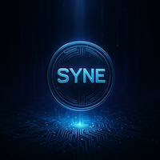

# SYNTHEON (SYNE) Token

**SYNTHEON** is the official token of the SYNETHEON project — an AI-driven force forged in the fires of Magnus. Designed for cutting-edge integration across intelligent systems, immersive experiences, and autonomous infrastructures, SYNE fuels a movement.

## Mission

To empower the future through intelligent autonomy, decentralized control, and unstoppable creativity.

## Token Information

- **Symbol**: SYNE
- **Name**: SYNTHEON
- **Standard**: [Token-2022 (Solana)](https://spl.solana.com/token-2022)
- **Decimals**: 9
- **Mint Address**: `7Sx32mr6qnjgow43w7KWbvxT2sYUtyP7ZVdgc2ey8JvQ`
- **Metadata URI**: [Pinata IPFS](https://gateway.pinata.cloud/ipfs/bafkreidx4ggt7kugmlku3tt25zidqwlxyelq7cjqgytcil5shagj4qetcm)

## Status

- ✅ Metadata embedded on-chain
- ✅ Mint authority revoked
- ❌ No freeze authority set (immutable)
- ✅ Supply: 1,000,000,000 SYNE (fixed)

## Wallet Compatibility

- Phantom: Full metadata and logo display
- Solflare: Verified display with Metaplex metadata
- Coinomi: Works, but logo display may vary

## Website

Visit the official site: [https://synetheon.dev](https://synetheon.dev)  
Alternate domain: [https://syntheon.xyz](https://syntheon.xyz)

---

Forged by Magnus. Driven by vision. Protected by code.

*2025 © SYNETHEON*

